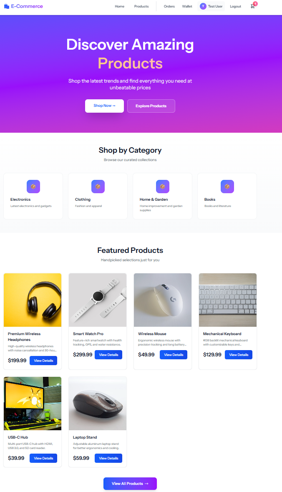
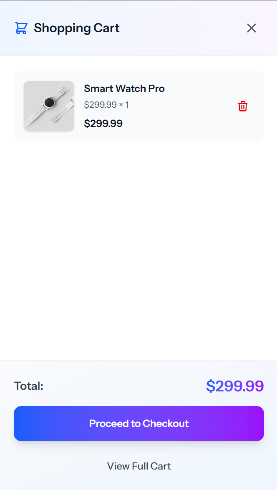
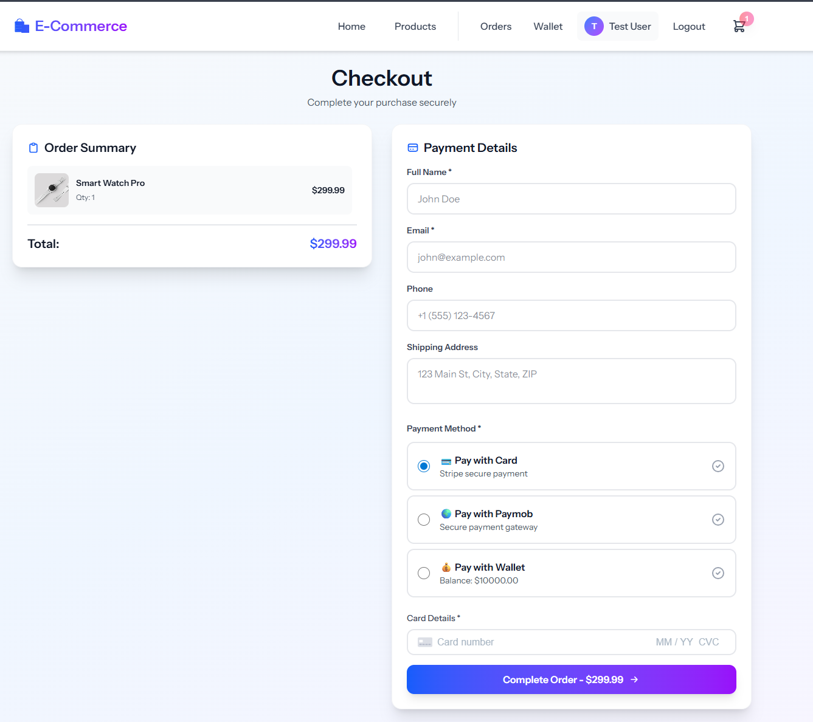

# E-Commerce Demo - Laravel + Inertia + Vue 3 + Stripe & Paymob

A complete e-commerce application built with Laravel 12, Inertia.js, Vue 3, TailwindCSS, Stripe, and Paymob payments.

## 📸 Demo

<p align="center">
  
  
  
</p>

<p align="center">
  
  
  
</p>

<p align="center">
  
  
  
</p>

## ✨ Features

- **Storefront** - Home page, product catalog with filters, product details
- **Shopping Cart** - Session-based cart with drawer, guest & authenticated support
- **Multiple Payment Methods** - Stripe, Paymob, Wallet payments
- **User Accounts** - Authentication, order history, wallet system
- **Admin Panel** - Dashboard, product/order/transaction management, refunds
- **Webhooks** - Stripe & Paymob webhook handling with signature verification

## 🚀 Quick Start

### Prerequisites
- PHP 8.2+, Composer, Node.js & npm
- Stripe account (test mode)
- Paymob account (optional)

### Installation

```bash
# Install dependencies
composer install && npm install

# Setup environment
cp .env.example .env
php artisan key:generate

# Configure payment providers in .env
STRIPE_KEY=pk_test_...
STRIPE_SECRET=sk_test_...
STRIPE_WEBHOOK_SECRET=whsec_...

# Paymob (optional)
PAYMOB_API_KEY=your_api_key
PAYMOB_IFRAME_ID=your_iframe_id
PAYMOB_INTEGRATOR=your_integration_id
PAYMOB_HMAC=your_hmac_secret

# Run migrations
php artisan migrate --seed

# Start development
npm run dev
php artisan serve
```

### Webhook Setup

**Stripe (Local):**
```bash
stripe listen --forward-to http://localhost:8000/webhooks/stripe
```

**Paymob:**
- Use ngrok for local: `ngrok http 8000`
- Configure webhook URL in Paymob dashboard: `https://your-url/webhooks/paymob`

## 📋 Default Credentials

- **Admin**: `admin@example.com` / `password`
- **User**: `test@example.com` / `password`

## 🏗️ Tech Stack

- **Backend**: Laravel 12 (PHP 8.2+)
- **Frontend**: Inertia.js + Vue 3 + TailwindCSS
- **Payments**: Stripe Payment Intents, Paymob iframe
- **Database**: SQLite (default) or MySQL/PostgreSQL

## 🔒 Security Features

- CSRF protection (webhook routes excluded)
- Webhook signature verification (Stripe & Paymob)
- Duplicate charge protection (idempotency keys)
- Admin middleware protection
- Input validation & SQL injection protection

## 📊 Key Routes

- `/` - Home
- `/products` - Product catalog
- `/checkout` - Checkout page
- `/orders` - Order history (auth required)
- `/admin/dashboard` - Admin panel
- `/admin/transactions` - Transaction management

## 🐛 Troubleshooting

**Webhook not working?**
- Verify webhook secrets in `.env`
- Check Laravel logs: `storage/logs/laravel.log`
- Test with Stripe CLI or ngrok for Paymob

**Payment fails?**
- Verify API keys are correct
- Check webhook is receiving events
- Review transaction logs in admin panel

## 📄 License

MIT License - Free to use for portfolio and learning purposes.

---

**Built with ❤️ using Laravel, Inertia.js, Vue 3, Stripe, and Paymob**
